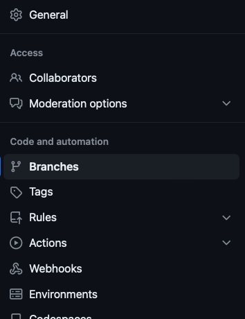
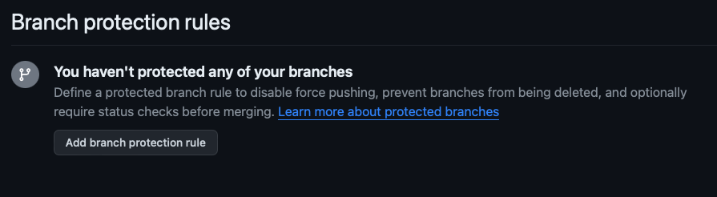
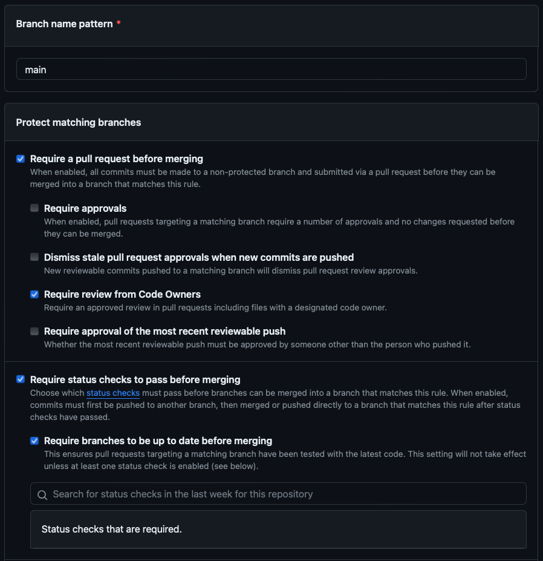
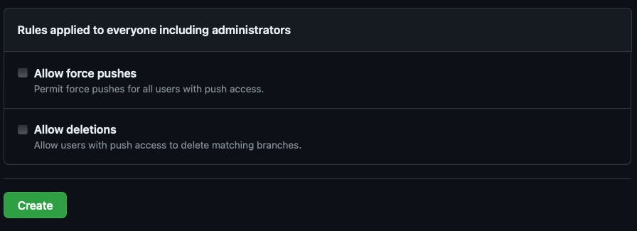

# Adding branch protection on main branch

### 03-15-2024

- In this project, I would like to have some protection on the main branch, that I need to review the codes before merging from another branch. So, I can reduce the chances that I, or any other future collaborators, to push some code into the main branch that will break the build.
- In order to do so, I went to _Setting_ tab in this repository, and chose _branch_ on the left side of the setting UI.

- Since this is now a new repository, there is no branch protection at all. I clicked the _Add new branch protection rule_ button.

- I added _main_ to the _branch name pattern_.
- I checked:
  1. Require a pull request before merging
    - As the description under the checkbox, all contributors will need to push changes onto a non-protected branch instead of pushing directly into the main branch, which will change the page immediately.
  2. Require review from Code Owner
  3. Require status checks to pass before merging
  4. Require branches to be up to date before merging
  5. Require deployments to succeed before merging
    - I have checked github-pages since I have used _github pages_ to deploy this repository.
    - I may update how to do this in the future.
  6. Do not allow bypassing the above setting
  
- Then click the create button at the bottom of the page

- So now the branch protection rule have applied to main branch. I can always come here to edit the rules applied to main branch (or any other branches that I specify in this setting or a new setting).