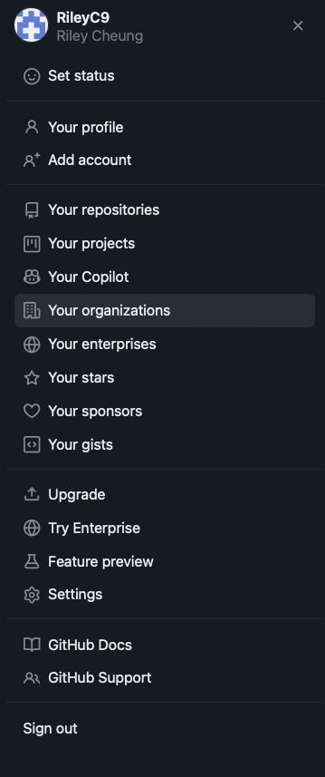
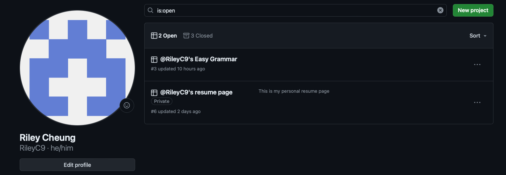
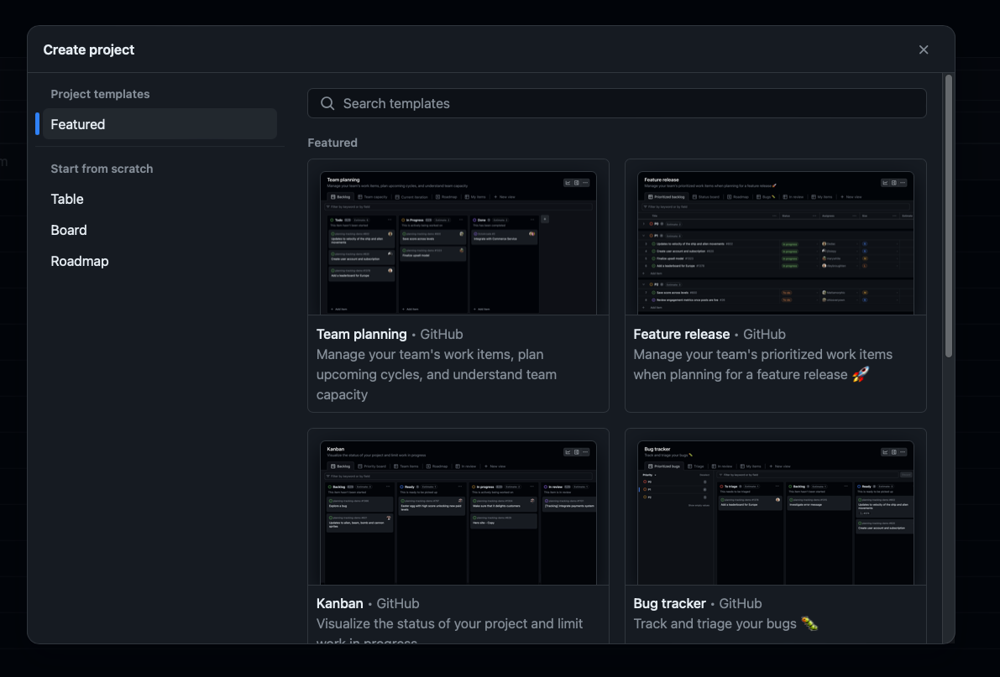
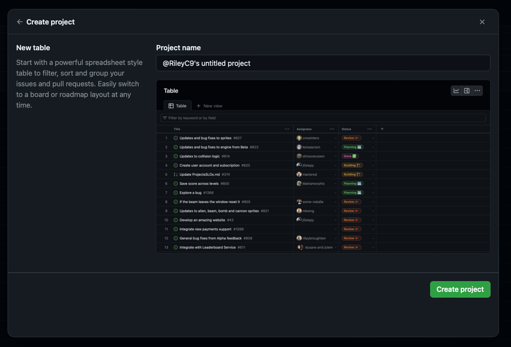

# Creating a project

### 03-15-2024

- GitHub provides a project feature for you (and your coding buddies) to track the progress of a project.
- And the steps to create a project is very simple.
1. Go to your menu by clicking the profile picture on the top right corner of the github dashboard.

2. Click on my projects in the dropdown menu

3. Click on the new Project button to create a new project

4. Choose a layout that fit your need or you preferred. (in this case, I choose table because it is clean and I am the only one working on this project right now.)

5. Enter the name of your project. (You can edit it later as well)

6. Click the _Create project_ button at the lower right corner.