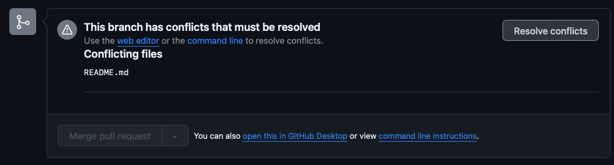
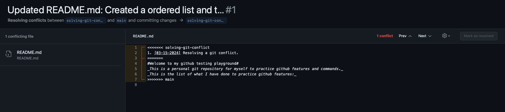
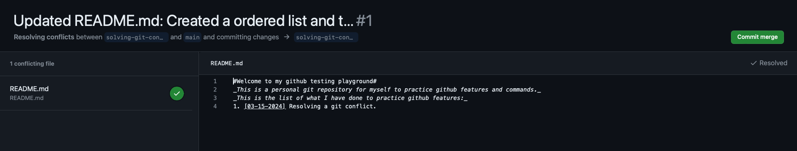

#Solving git conflict

###03-15-2024

- I have created 1 commit on main modifying this README.md, which I added the breif introduction above.
- I have also created a new branch called solving-git-conflict branch and another commit. It contains an update on the same README.md file about what I am doing for this practice.
- Later I pushed both commit and try to merge them by creating a pull request. This is what I received:

- The steps to solve this problem is:
  1. Click on the resolve conflict button. And I saw the following screen:
  
  2. Github then shows where the conflict is by displaying the changes for the 2 merging branches.
  3. Fix the code in the way that you desire and click the "Mark as resolved"
  4. The following screen will appear:
  
  5. Click the commit merge button and go on to the merging pull request process as usual.
  6. Conflict should have
